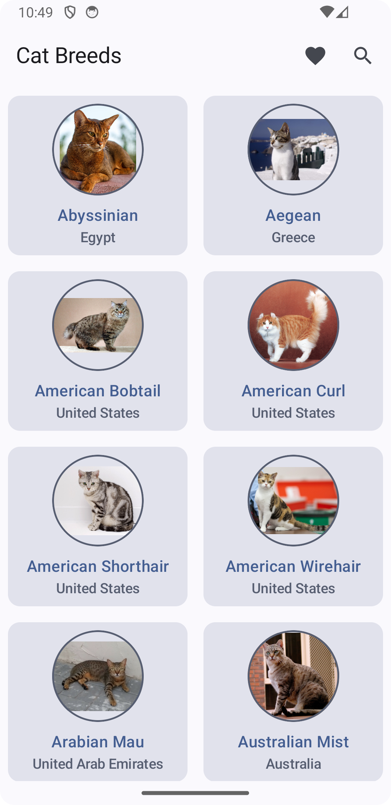
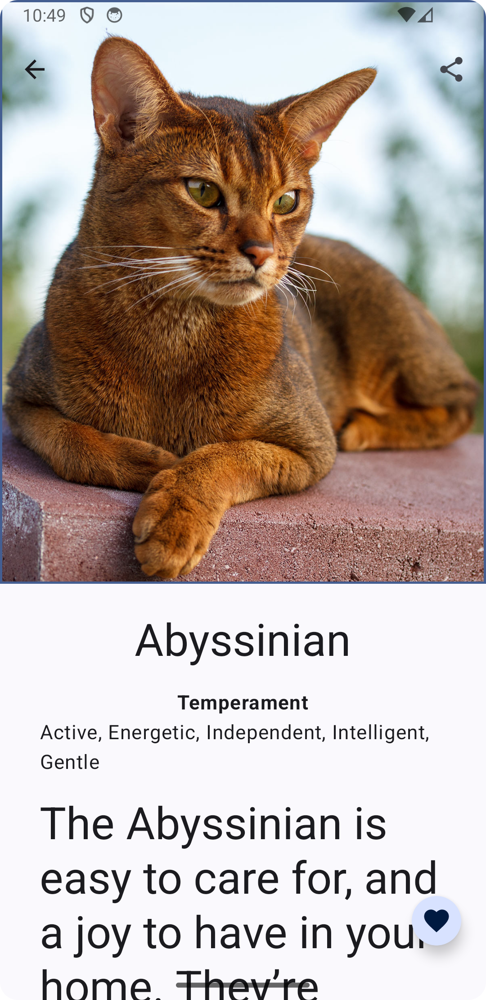
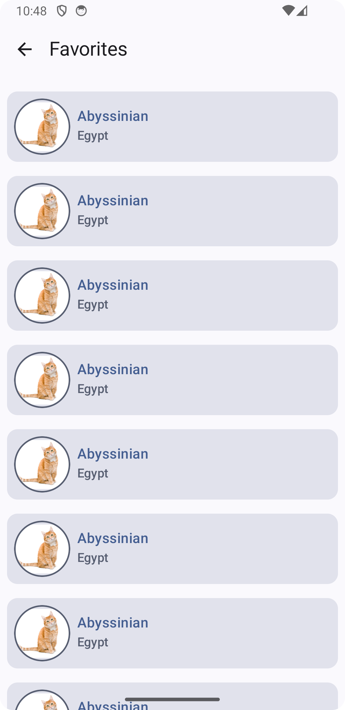

# The Cat Breeds Application
This repository contains the Android codebase for Cat Breeds application.

## Description

[Provide a brief and engaging description of your project. What does it do? What problem does it solve? What are its key features?]
This application allows users to explore various cat breeds, learn about their characteristics, and save their favorites.
It provides a user-friendly interface with detailed information and images for each breed.

## Features

* **Browse Cat Breeds:** Explore a comprehensive list of sword cat breeds.
* **Detailed Cat Breed Information:** [WIP] View detailed information about each breed, including origin, temperament, and physical characteristics.
* **High-Quality Images:** See beautiful images of each breed.
* **Favorites:** [WIP] Save your favorite breeds for quick access.
* **Search:** [WIP] Easily find breeds by name or characteristics.
* **Offline Support:** [WIP] Access breed information even without an internet connection.

## Screenshots

[Include a few screenshots showcasing the main features of your app.]

## Technologies Used

* **Kotlin:** The primary programming language used for development.
* **Jetpack Compose:** Modern UI toolkit for building native Android UIs.
* **Material:** Modern Design System for building native Android apps.
* **Navigation:** Modern graph navigation for building native Android apps.
* **Retrofit:** Networking library for making API calls.
* **Coroutines:** Asynchronous programming framework for handling background tasks.
* **Hilt:** [WIP] Dependency injection library for managing dependencies.
* **Room:** [WIP] Persistence library for storing data locally.

## Modularization
* **app:** The app module
* **feature:** The ui layer for screens and features
* **data:** The data layer for local and remote

## API

[If your app uses an external API, provide details about the API and how to access it.]

This app uses the [Cat API](https://thecatapi.com/) to fetch breed information and images. You will need to obtain an API key from the Cat API website and add it to the `local.properties` file in the project root directory.

## Todo List

[If you welcome contributions, provide guidelines on how others can contribute to your project.]
Bug fixes, new features, or improvements: 
- Update routes to send arguments to Detail, currently has hardcoded Cat Breed id;
- Search implementation, currently is just showing a toast;
- Update compose previews, now aren't working
- Room integration issues, now the integration is disabled but code is there
- Favorite button in each list item, needs ui and room integration
- Favorite list from database, repo needs room access 
- Hilt integration
- Paging integration
- Offline first approach
- Error Handling
- Create a launch Screen
- Unit Testing
- UI Testing

## License

[Specify the license under which your project is distributed.]

This project is licensed under the [MIT License](LICENSE).

